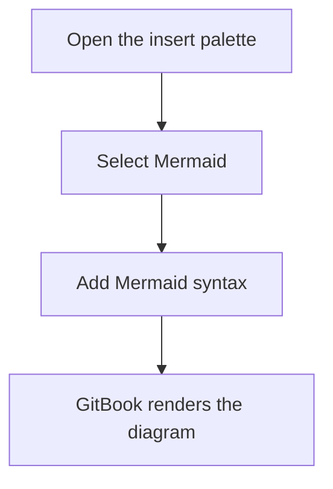

Mermaid blocks let you create diagrams using the [Mermaid](https://mermaid.ai/) syntax.

Use them when you want to show flows, sequences, states, or relationships in a format that's easy to update.

### Add a Mermaid block

1. Place your cursor on an empty line and type `/`.
2. Click **Mermaid** in the insert menu.
3. Enter or paste your Mermaid syntax. GitBook renders the diagram automatically.

You can also click the <strong>+</strong> to the left of any line in the editor and click **Mermaid**.

### Example



### Representation in Markdown

````markdown

````

GitBook renders code blocks with the `mermaid` language identifier as native Mermaid blocks.<br />

### Troubleshooting

If your Mermaid diagram isn't rendering, check these common causes:

- **Syntax errors** — review your Mermaid code for typos, compare it with examples in the Mermaid documentation, or test it in the [Mermaid Live Editor](https://mermaid.live/) to isolate the issue.
- **Code block instead of Mermaid block** — Mermaid code won't render inside a standard code block. Press `/` and select **Mermaid diagram** to insert the right block type.
- **Older Mermaid content** — Mermaid is a native block, so no integration is needed. If you created Mermaid content before native block support, GitBook converts it automatically the next time you edit the page.
