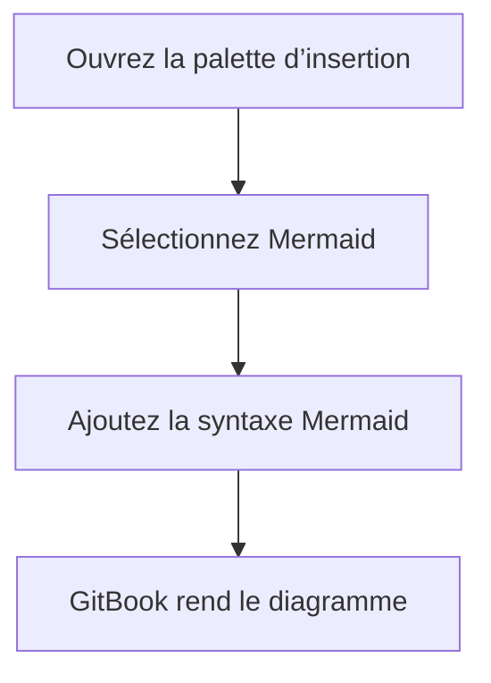

Les blocs Mermaid vous permettent de créer des diagrammes à l’aide de la [Mermaid](https://mermaid.ai/) syntaxe.

Utilisez-les lorsque vous voulez afficher des flux, des séquences, des états ou des relations dans un format facile à mettre à jour.

### Ajouter un bloc Mermaid

1. Placez le curseur sur une ligne vide et tapez `/`.
2. Cliquez **Mermaid** dans le menu d’insertion.
3. Saisissez ou collez votre syntaxe Mermaid. GitBook rend le diagramme automatiquement.

Vous pouvez aussi cliquer sur le <strong>+</strong> à gauche de n’importe quelle ligne dans l’éditeur, puis cliquer sur **Mermaid**.

### Exemple



### Représentation en Markdown

````markdown

````

GitBook rend les blocs de code avec le `mermaid` identifiant de langue comme des blocs Mermaid natifs.<br />

### Dépannage

Si votre diagramme Mermaid ne s’affiche pas, vérifiez ces causes courantes :

- **Erreurs de syntaxe** — relisez votre code Mermaid pour y déceler des fautes de frappe, comparez-le avec des exemples dans la documentation Mermaid, ou testez-le dans le [Mermaid Live Editor](https://mermaid.live/) pour isoler le problème.
- **Bloc de code au lieu d’un bloc Mermaid** — le code Mermaid ne s’affichera pas dans un bloc de code standard. Appuyez sur `/` et sélectionnez **diagramme Mermaid** pour insérer le bon type de bloc.
- **Contenu Mermaid ancien** — Mermaid est un bloc natif, donc aucune intégration n’est nécessaire. Si vous avez créé du contenu Mermaid avant la prise en charge des blocs natifs, GitBook le convertit automatiquement la prochaine fois que vous modifiez la page.
