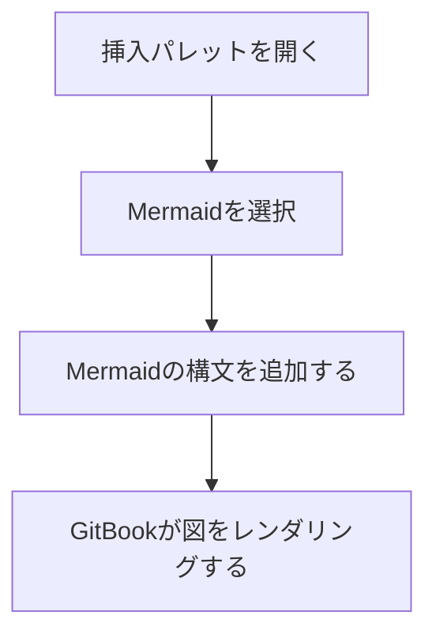

Mermaidブロックを使うと、図を作成できます。 [Mermaid](https://mermaid.ai/) 構文。

フロー、シーケンス、状態、関係性を、更新しやすい形式で示したいときに使います。

### Mermaidブロックを追加する

1. 空行にカーソルを置いて、次を入力します `/`.
2. クリックして **Mermaid** 挿入メニューで。
3. Mermaidの構文を入力または貼り付けます。GitBookが自動で図をレンダリングします。

また、 <strong>+</strong> エディター内の任意の行の左側にある **Mermaid**.

### 例



### Markdownでの表記

````markdown

````

GitBookは `mermaid` 言語識別子を使ったコードブロックを、ネイティブのMermaidブロックとしてレンダリングします。<br />

### トラブルシューティング

Mermaid図がレンダリングされない場合は、次の一般的な原因を確認してください:

- **構文エラー** — Mermaidコードの টাইポを確認し、Mermaidドキュメントの例と比較するか、次の [Mermaid Live Editor](https://mermaid.live/) で問題を切り分けてください。
- **Mermaidブロックではなくコードブロック** — Mermaidコードは標準のコードブロック内ではレンダリングされません。次を押してください `/` をクリックして、次を選択します **Mermaid図** を挿入して、正しいブロックタイプを選択します。
- **古いMermaidコンテンツ** — Mermaidはネイティブブロックのため、統合は不要です。ネイティブブロック対応前にMermaidコンテンツを作成していた場合でも、ページを次回編集するとGitBookが自動的に変換します。
