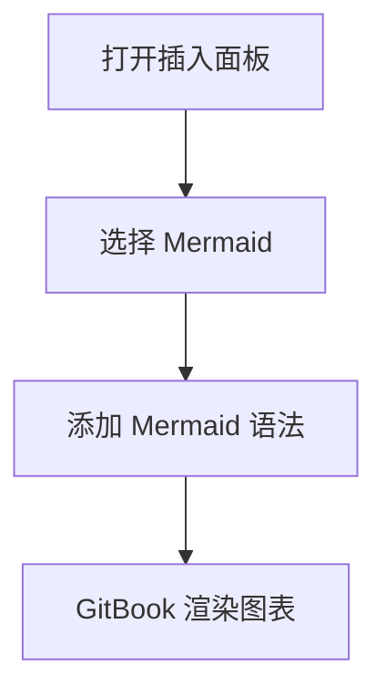

Mermaid 块让你可以使用 [Mermaid](https://mermaid.ai/) 语法来创建图表。

当你想以一种易于更新的格式展示流程、顺序、状态或关系时，请使用它们。

### 添加 Mermaid 块

1. 将光标放在空白行上并输入 `/`.
2. 点击 **Mermaid** ，位于插入菜单中。
3. 输入或粘贴你的 Mermaid 语法。GitBook 会自动渲染该图表。

你也可以点击 <strong>+</strong> 编辑器中任意一行左侧的 **Mermaid**.

### 示例



### Markdown 中的表示方式

````markdown

````

GitBook 会将带有以下语言标识符的代码块渲染为 `mermaid` 原生 Mermaid 块。<br />

### 故障排除

如果你的 Mermaid 图表没有渲染，请检查以下常见原因：

- **语法错误** — 检查你的 Mermaid 代码是否有拼写错误，将其与 Mermaid 文档中的示例进行比较，或在 [Mermaid Live Editor](https://mermaid.live/) 中测试以定位问题。
- **代码块而不是 Mermaid 块** — Mermaid 代码不会在标准代码块中渲染。按下 `/` 并选择 **Mermaid 图表** 以插入正确的块类型。
- **较早的 Mermaid 内容** — Mermaid 是一种原生块，因此不需要集成。如果你在原生块支持之前创建了 Mermaid 内容，GitBook 会在你下次编辑页面时自动将其转换。
